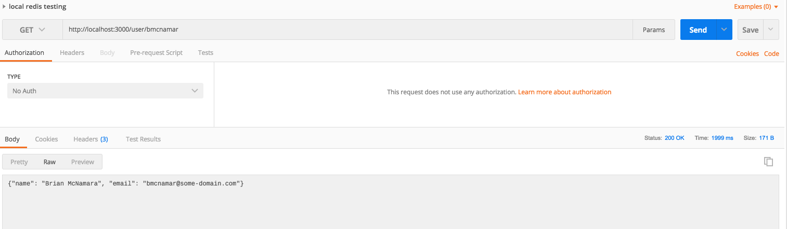
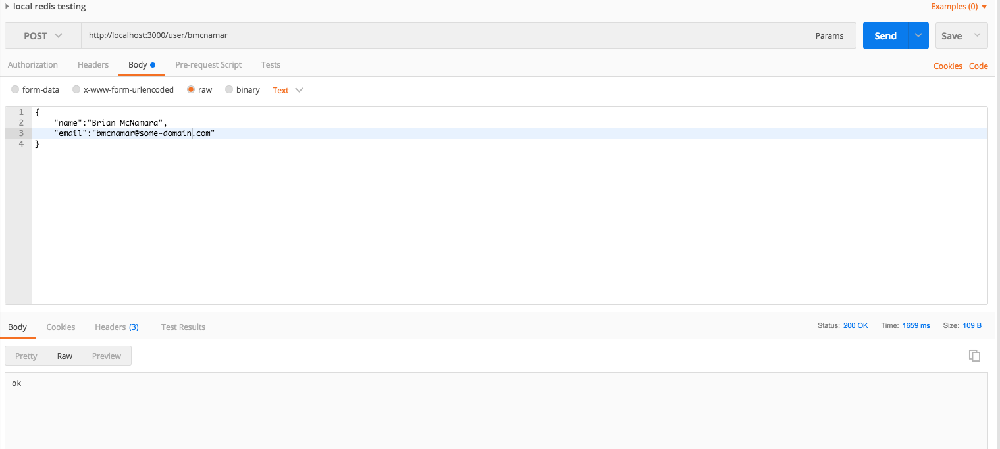

# redisApp

The purpose of this example is to illustrate how to do local testing of a REST endpoint with an existing redis [Docker](https://www.docker.com/) container.

# Run Function Locally Using sam local

This will allow an existing redis docker container to interact with the sample function.  The redis container and the container started by sam local will need to reside on the same Docker network.

## Create a Docker Network

```
docker network create <DOCKER NETWORK NAME>
```

eg.

```
docker network create sam-demo
```

## Run the Redis Container

```
docker run --network <DOCKER NETWORK NAME> --name redis-server -d redis
```

eg.

```
docker run --network sam-demo --name redis-server -d redis
```

## Connect to the redis Container Using redis-cli

```
docker run -it --network <DOCKER NETWORK NAME> --link redis-server:redis --rm redis redis-cli -h redis -p 6379
```

eg. 

```
docker run -it --network sam-demo --link redis-server:redis --rm redis redis-cli -h redis -p 6379
```

## Run the sam local Container


```
sam local start-api --docker-network <DOCKER NETWORK NAME>
```

eg.

```
sam local start-api --docker-network sam-demo
```

## Query the Application

Any HTTP client can be used to get a resource.  Here is an example using [Postman](https://www.getpostman.com/).



## Post Data to the Application

Any HTTP client can be used to create a resource.  Here is an example using [Postman](https://www.getpostman.com/).



# Deploy Function to AWS

This application is only meant to illustrate how a SAM application can be used to access a docker container.  Further work will need to be done to provision an ElastiCache cluster.
