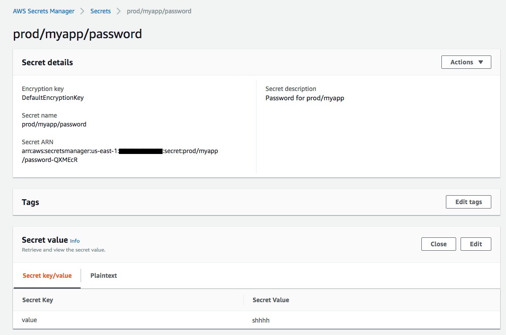

# managing-secrets-python

This example will deploy a very simple Lambda function that will utilize data stored in AWS Secrets Manager.

# Pre-requisite

There are two dependencies in this example that surround IAM and Secrets Manager.

## IAM

The template assumes an existing IAM Role named `secrets-manager-example` with an in-line policy that has the following JSON policy document.  Please note the account ID 1234567890 should be replaced with your account ID

```
{
    "Version": "2012-10-17",
    "Statement": [
        {
            "Effect": "Allow",
            "Action": "secretsmanager:GetSecretValue",
            "Resource": [
                "arn:aws:secretsmanager:us-east-1:1234567890:secret:prod/myapp/*"
            ]
        }
    ]
}
```

## Secrets Manager

Secrets Manager should have a secret stored in the key `prod/myapp/password` where the *Secret Key* is `value` and the *Secret Value* can be any text.  In the screenshot below, the *Secret Value* is `shhhh`.



# Deploy Function to AWS

Once the pre-requisites are met the function can be deployed.  The deployment step uses a SAM parameter named *SecretKey* to pass along the secret to decrypt.  In our example, the *SecretKey* is `prod/myapp/password`.

## Package the Function

```
sam package --template-file template.yml \
--output-template-file packaged-template.yml \
--s3-bucket <YOUR S3 BUCKET>
```

eg.

```
sam package --template-file template.yml \
--output-template-file packaged-template.yml \
--s3-bucket asap_sandbox
```

## Deploy Function Using Cloudformation

```
sam deploy --template-file packaged-template.yml \
--stack-name <YOUR STACK NAME> \
--parameter-overrides SecretKey=<YOUR KEY> \
--capabilities CAPABILITY_IAM
```

eg.

```
sam deploy --template-file packaged-template.yml \
--stack-name secretsManagerPython \
--parameter-overrides SecretKey='prod/myapp/password' \
--capabilities CAPABILITY_IAM
```
